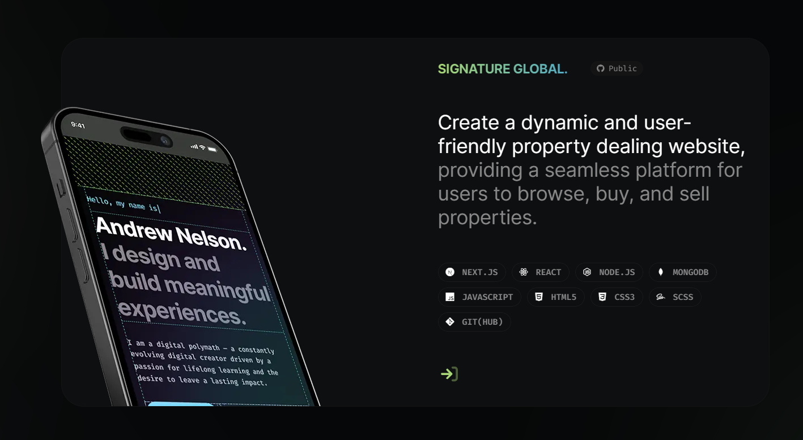

  <h1>Satyadeepraj | portfolio</h1>
  

  
  
  
  
    

## This website is still being developed! 🥳
The porftfolio application has currently hit the Beta phase and is ready to be forked if you are familiar with React and Next. The next release cycle will focus on a better DX—moving from local JSON to MongoDB, setting up Sanity for GUI page editing, Unit Testing with Jest, adding TypeScript, etc.

#### Next & App Architecure
- [ ] Next.js v13 : Waiting for /app/ folder to leave beta
- [ ] Sanity.io

#### App Architecure & Design Systems
- [ ] App\Systems\Margins : Continuing to develop Design Token System
- [ ] App\Systems\Padding : Continuing to develop Design Token System

#### Pages
- [x] Pages\About
- [ ] Pages\Case Studies
- [x] Pages\Projects : Single project details page

#### Projects Page
- [ ] Pages\Projects\Project : Single project details page

## Please fork this repo! 🦄

Fork, Install, Editing, and Deploy instructions coming soon(ish)!

This is my first open-source contribution, and it was also a great oppoortunity for me to learn! 

It is my hope that by sharing this project it can give others a chance to enjoy learning Nextjs (and have as much fun as I did), and hopefully brings value to people as a portfolio and networking tool!

